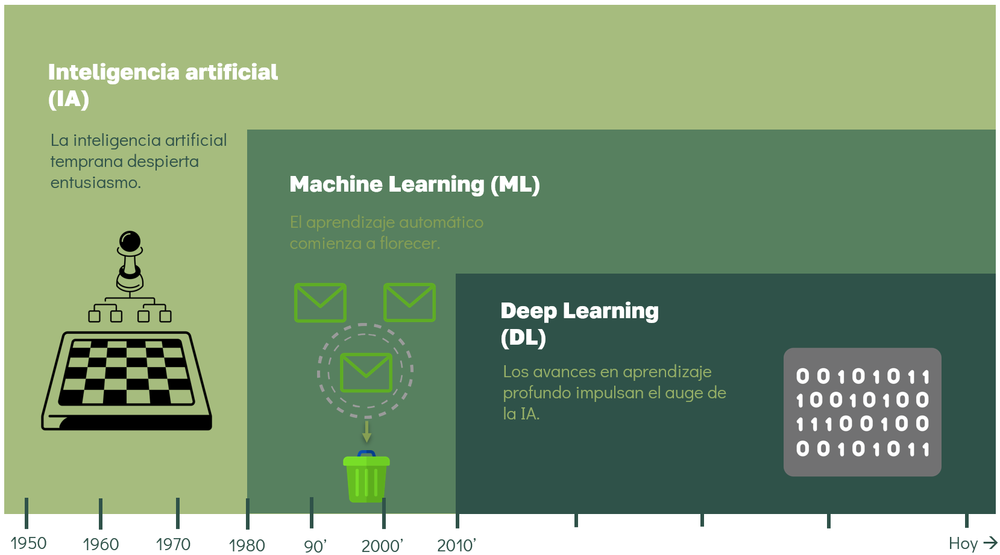

# I. Introducción al Machine Learning

La inteligencia artificial (IA), el _Machine Learning_ (ML), el _Deep Learning_ (DL) y las redes neuronales son conceptos estrechamente relacionados. Sin embargo, los términos suelen emplearse de manera intercambiable, lo que con frecuencia genera confusión respecto a sus diferencias.

## ¿De qué hablamos cuando nos referimos a ML?

En la **Figura 1** se muestra la relación entre estos conceptos, que pueden visualizarse como un diagrama de Venn.

```{figure} ../_static/img2.png
:alt: representacion
:fig-align: center
:width: 200px
```

> **Inteligencia artificial**
>
> - Es el campo más amplio.
> - Busca que las máquinas imiten procesos de la inteligencia humana (razonar, aprender, tomar decisiones).
> - Puede incluir desde reglas programadas explícitamente (`if/else`, algoritmos heurísticos) hasta métodos más avanzados.

```{figure} ../_static/img3.png
:alt: representacion
:fig-align: center
:width: 200px
```

> **Machine Learning**
>
> - Subconjunto de la IA.
> - Los algoritmos aprenden a partir de **datos** en lugar de depender solo de reglas programadas.
> - Requiere intervención humana para:
>
>   - Selección de características (feature engineering).
>   - Preparación de _datos estructurados_.
>   - Elección del modelo adecuado.
>
> - También se le conoce como _statistical learning_ o _predictive analytics_.

```{figure} ../_static/img4.png
:alt: representacion
:fig-align: center
:width: 200px
```

> **Deep Learning**
>
> - Es un subconjunto de ML.
> - Utiliza redes neuronales profundas para aprender automáticamente las características relevantes, incluso a partir de _datos no estructurados_ (imágenes, audio, texto).
> - Reduce la necesidad de ingeniería manual de características: el modelo extrae por sí mismo los rasgos importantes.

A continuación, se presenta una imagen que ilustra de manera global cómo se relacionan estos conceptos:



**Figura 1.** Diferencias entre conceptos clave. Imagen traducida y adaptada de [NVIDIA.](https://blogs.nvidia.com/blog/whats-difference-artificial-intelligence-machine-learning-deep-learning-ai/)

---

### Breve perspectiva histórica

(i) En **1950**, Alan Turing planteó la pregunta _“¿Pueden las máquinas pensar?”_, dando origen al campo de estudio que buscaba evaluar la inteligencia de las máquinas.

(ii) Los **primeros avances** se basaban en conjuntos predefinidos de reglas. Por ejemplo, programas de ajedrez implementaban instrucciones codificadas a mano mediante estructuras de decisión del tipo `if/else` para responder a situaciones específicas.

(iii) En este contexto, **IA** se entendía como cualquier intento de simular tareas intelectuales humanas con una computadora, independientemente de la complejidad del sistema.

(iv)Con la llegada del **ML**, el enfoque cambió: en lugar de programar reglas explícitas, se diseñaron algoritmos capaces de aprender patrones directamente a partir de los datos.

---

### Componentes de un modelo de ML

De manera general, cualquier modelo de ML se puede describir a partir de tres elementos fundamentales:

1. **Modelo matemático**: representa la hipótesis o función que intenta capturar la relación entre variables de entrada y salida.

2. **Función objetivo / función de costo**: mide el error o la discrepancia entre las predicciones del modelo y los valores reales.

3. **Algoritmo de aprendizaje (optimización)**: define cómo se ajustan los parámetros del modelo para minimizar la función de costo.

En la práctica, la variación entre diferentes algoritmos de ML suele estar en una de estas tres piezas, mientras que las demás se mantienen relativamente constantes.

---

## ¿Por qué el ML se volvió tan relevante?

- Disponibilidad masiva de datos
- incremento del poder de cómputo
- avances en algoritmos que permiten aplicaciones reales en múltiples dominios.

## ¿Qué clase de problemas puede resolver el ML?

_Machine Learning_ puede resolver una amplia variedad de problemas al automatizar procesos de decisión a partir de datos.

Principalmente, se divide en dos paradigmas:

```{figure} ../_static/img5.png
:alt: representacion
:fig-align: center
:width: 200px
```

En el **aprendizaje supervisado**, los algoritmos aprenden de ejemplos con entradas y salidas conocidas para luego generalizar en casos nuevos, como la detección de spam en correos, el reconocimiento de dígitos manuscritos, el diagnóstico médico en imágenes o la detección de fraudes en transacciones.

```{figure} ../_static/img6.png
:alt: representacion
:fig-align: center
:width: 200px
```

Por otro lado, en el **aprendizaje no supervisado** los algoritmos trabajan solo con datos de entrada para descubrir patrones ocultos, como identificar temas recurrentes en un conjunto de textos.

## ¿Por qué usar Python para ML?

- Ecosistema robusto de bibliotecas y frameworks
- Comunidad activa y recursos abundantes
- Facilidad de aprendizaje y uso
- Integración con otras tecnologías

### Referencias

Müller, Andreas C., and Sarah Guido. Introduction to Machine Learning with Python: A Guide for Data Scientists. O’Reilly Media, 2016.

M. Copeland, “What’s the Difference Between Artificial Intelligence, Machine Learning, and Deep Learning?”, NVIDIA Blog, Jul. 29, 2016. [Online].

IBM, “AI vs. machine learning vs. deep learning vs. neural networks: What’s the difference?”, IBM Think Blog, Jul. 6, 2023. [Online].